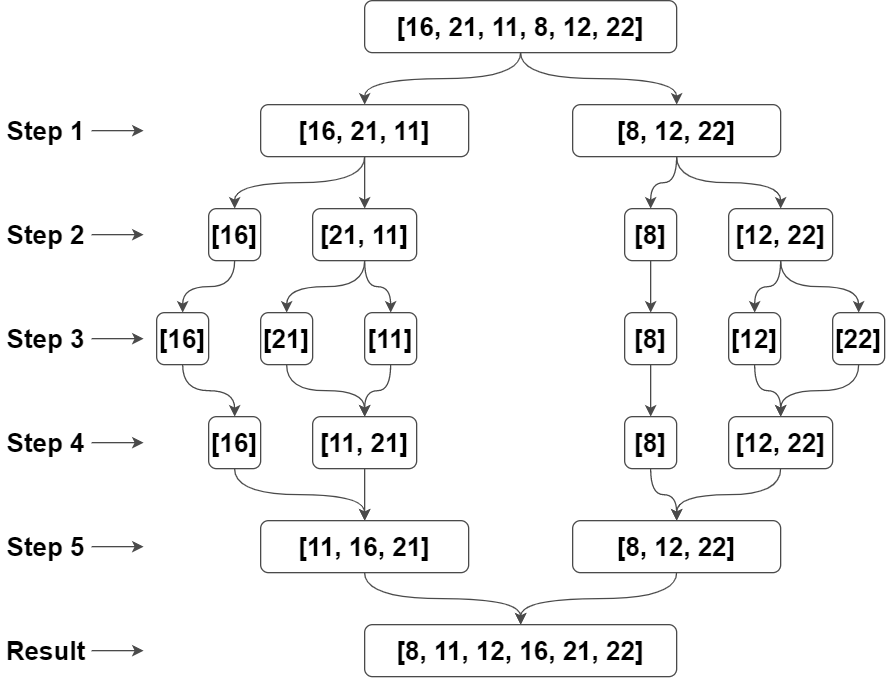
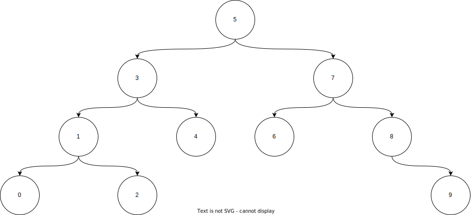

# Insertion Sort

```
[22,27,16,2,18,6] => Insertion Sort
```

##### Soru 1) Yukarıda verilen dizinin Sort türüne göre aşamalarını yazınız.

```
[22,27,16,2,18,6] => Aşama 1 (n)

[2,27,16,22,18,6] => Aşama 2 (n-1)

[2,6,16,22,18,27] => Aşama 3 (n-2)

[2,6,16,18,22,27] => Aşama 4 (1)
```

##### Soru 2) Big-O gösterimini yapınız.

```
n + (n-1) + (n-2) + 1 = n.(n+1) / 2 

(n^2 +n) / 2 = O(n^2)
```

##### Soru 3) **Average Case**, Worst Case, Best Case durumlarını bulun.

```
Average Case
[2,6,16,18,22,27] => 16 - 18
Worst Case
[2,6,16,18,22,27] => 27
Best Case 
[2,6,16,18,22,27] => 2
```

##### Soru 4) Dizi sıralandıktan sonra 18 sayısı hangi case kapsamına girer?

```
Average case kapsamına girer.
```

##### Soru 5) Aşağıdaki dizinin Insertion Sort'a göre ilk 4 adımını yazınız.

```
[7,3,5,8,2,9,4,15,6]
```

```
[7,3,5,8,2,9,4,15,6] => Aşama 1 (n) 
[2,3,5,8,7,9,4,15,6] => Aşama 2 (n-1) 
[2,3,4,8,7,9,5,15,6] => Aşama 3 (n-2) 
[2,3,4,5,7,9,8,15,6] => Aşama 4 (n-3)
```

# Merge Sort

```
[16,21,11,8,12,22]
```

##### Soru 1) Yukarıdaki dizinin sort türüne göre aşamalarını yazınız.

<center></center>

##### Soru 2) Big-O gösterimini yapınız.

```
Her aşamada O(n) gelir.
n = 2^x
logn = x
O(n logn)
```

# Binary Search

##### Soru 1) Aşağıdaki dizinin Binary-Search-Tree aşamalarını yazınız.

```
[7,5,1,8,3,6,0,9,4,2]
```

```
Küçükten büyüğe sıralama
[0,1,2,3,4,5,6,7,8,9]
Root Değer = 5
Binary Search:
```

<center></center>